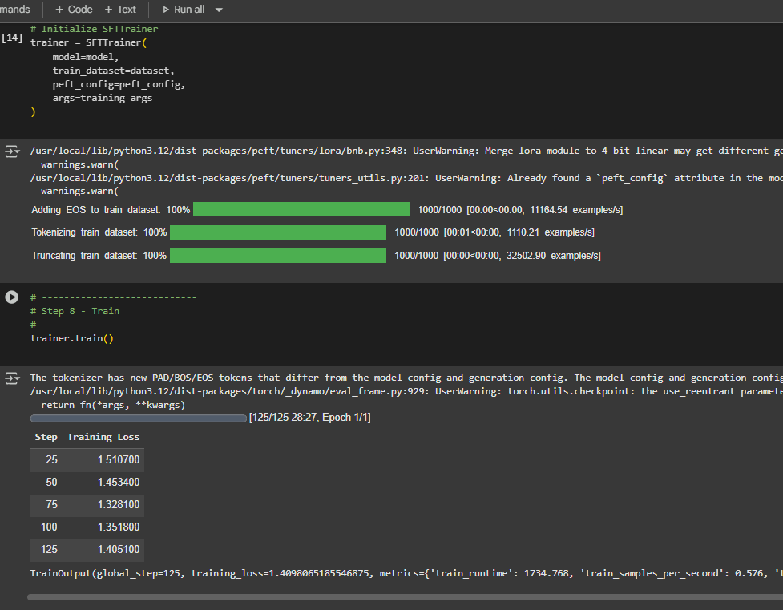

# LLaMA-2 QLoRA Fine-Tuning Pipeline

## Project Overview
- Developed a **Python-based pipeline** to fine-tune **LLaMA-2 7B** using **LoRA adapters**.
- Leveraged **QLoRA (4-bit quantization with bitsandbytes)** for memory-efficient training on **T4 GPUs (16GB VRAM)**.
- Trained **instruction-following adapters (~16M parameters)** for custom tasks without updating the full model.

## Data
- Fine-tuned on **instruction datasets** such as `mlabonne/guanaco-llama2-1k` from Hugging Face.
- Dataset contains **1,000+ instruction-response pairs** for training adapters.
- Supports **custom datasets** in CSV/TSV format for domain-specific tasks.

## Key Features
- **Memory-efficient 4-bit base model loading** using **bitsandbytes**.
- **LoRA adapters** attached to `q_proj` and `v_proj` layers for low-rank adaptation.
- **TRL SFTTrainer** integration for supervised fine-tuning.
- Supports batch datasets and saves adapters separately for inference.
- Easy integration with existing LLaMA-2 models for downstream tasks.

## Tech Stack
- **Python**, **PyTorch**, **Transformers**, **PEFT (LoRA)**, **bitsandbytes (QLoRA)**, **TRL SFTTrainer**

