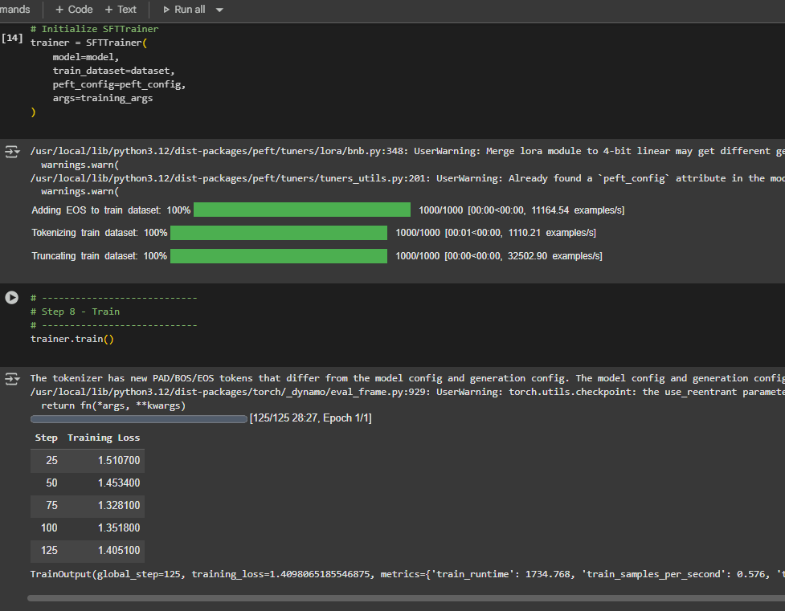
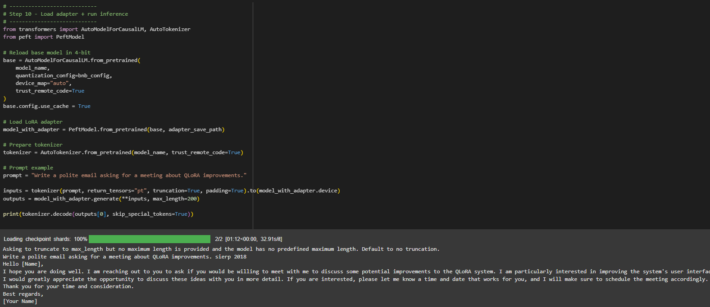

# LLaMA-2-7B QLoRA Fine-Tuning

QLoRA instruction-tune of **Llama-2-7B-chat** on a single free **Kaggle T4**.
The trained LoRA adapter is published to the Hugging Face Hub.

**Model:** https://huggingface.co/abdur-rahman77/llama2-7b-qlora-guanaco
**Notebook run:** https://www.kaggle.com/code/abdurrahmanrussel/llama2-qlora-guanaco



## Result

| metric | value |
|---|---|
| final training loss | **1.47** (from 2.06) |
| steps / epochs | 125 / 1 |
| runtime | ~83 min on one T4 |
| trainable params | ~16M (LoRA on `q_proj`, `v_proj`) |
| adapter size | 67 MB |

## What it does

- Loads `NousResearch/Llama-2-7b-chat-hf` in **4-bit NF4** (double-quant, bf16 compute) with bitsandbytes.
- Attaches **LoRA** adapters (r=32, alpha=16, dropout=0.05) to the attention projections.
- Supervised fine-tune with **TRL `SFTTrainer`** on `mlabonne/guanaco-llama2-1k`
  (1,000 multilingual instruction-response pairs in Llama-2 chat format).
- Saves the adapter only and pushes it + a model card to the Hub.

## Config

```
QLoRA        4-bit NF4, bnb_4bit_use_double_quant=True, compute dtype bfloat16
LoRA         r=32, alpha=16, dropout=0.05, target_modules=[q_proj, v_proj]
Training     1 epoch, batch 1 x grad-accum 8 (eff. 8), lr 2e-4 cosine, warmup 0.03
             max_seq_len 256, optim paged_adamw_32bit, gradient checkpointing
Precision    bf16 end to end (no fp16 grad scaler)
Hardware     Kaggle GPU T4 x2 (training pinned to one GPU)
```

## Reproduce

`train.ipynb` — 9 cells. On Kaggle:

1. Accelerator **GPU T4 x2**, Internet **On**.
2. Add-ons → Secrets → add `HF_TOKEN` (a Hugging Face **write** token).
3. Run **cell 1** (installs the pinned stack), then **Run → Restart session**.
4. Run cells 2–9 top to bottom.

Do **not** pick the P100 — current Kaggle PyTorch dropped support for it.

## Environment (Aug 2026)

Kaggle's default image ships `torch 2.10` + `transformers 5.0`, and **transformers 5.0
breaks the bitsandbytes 4-bit load path** (the model loads in fp16 and OOMs). Pin:

```
transformers==4.56.2   trl==0.21.0   peft==0.15.2
accelerate==1.10.1     bitsandbytes==0.47.0   datasets>=3.0
```

Install, then restart the kernel (otherwise the already-imported `transformers` wins).

## Failure modes hit — and fixes

| symptom | cause | fix |
|---|---|---|
| `no kernel image is available for execution` | Kaggle **P100** is sm_60, dropped by current PyTorch | use **GPU T4 x2** |
| CUDA OOM at load, ~14 GiB used, 4-bit not applied | `transformers==5.0` broke the bnb quant hook | pin `transformers==4.56.2` |
| `No module named 'bitsandbytes'` | not in Kaggle's current image | `pip install bitsandbytes` |
| `index is on cuda:1, different from ... cuda:0` | T4 **x2** → `Trainer` wraps model in `DataParallel` | `trainer.args._n_gpu = 1` |
| `_amp_foreach_non_finite_check_and_unscale_ ... BFloat16` | `fp16=True` grad scaler + bf16 grads | `bf16=True, fp16=False` |
| CUDA OOM even on a "fresh" run | stale allocations from a prior failed run | **Restart session**, not just re-run the cell |
| `get_secret` 400 / ConnectionError | Kaggle Secrets service flaky; CLI push can't attach secrets | add the secret in the UI, or paste the token into cell 3 |

## Usage

```python
from transformers import AutoModelForCausalLM, AutoTokenizer, BitsAndBytesConfig
from peft import PeftModel
import torch

bnb = BitsAndBytesConfig(load_in_4bit=True, bnb_4bit_quant_type="nf4",
                         bnb_4bit_compute_dtype=torch.bfloat16)
base = AutoModelForCausalLM.from_pretrained(
    "NousResearch/Llama-2-7b-chat-hf", quantization_config=bnb, device_map="auto")
model = PeftModel.from_pretrained(base, "abdur-rahman77/llama2-7b-qlora-guanaco")
tok = AutoTokenizer.from_pretrained("abdur-rahman77/llama2-7b-qlora-guanaco")

prompt = "<s>[INST] Explain QLoRA in two sentences. [/INST]"
out = model.generate(**tok(prompt, return_tensors="pt").to(model.device), max_new_tokens=200)
print(tok.decode(out[0], skip_special_tokens=True))
```

## Tech stack

Python · PyTorch · Transformers · PEFT (LoRA) · bitsandbytes (QLoRA) · TRL `SFTTrainer` · Hugging Face Hub


